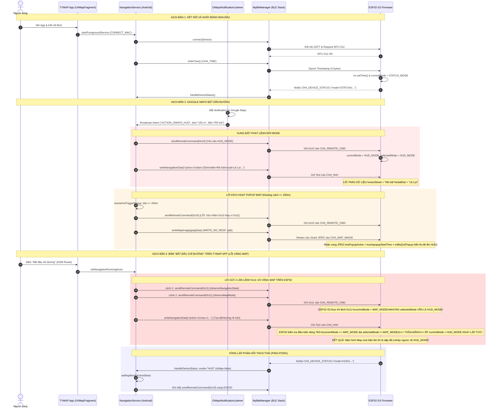

# BÁO CÁO TOÀN DIỆN HIỆN TRẠNG HỆ THỐNG TYMAP (GIAI ĐOẠN 1: AS-IS AUDIT)

> **Vai trò**: Chuyên gia Kiến trúc Hệ thống (System Architect) & Trưởng nhóm Kiểm thử (QA Lead)  
> **Thời gian thẩm tra**: 07/09/2026  
> **Phạm vi kiểm tra**:
> - Android App: [`TYMAP/app`](file:///d:/Documents/PlatformIO/Tdriver/TYMAP/app)
> - Firmware 1 (ESP32-C3 OLED SH1106): [`TYMAP/firmware/esp32_c3_oled`](file:///d:/Documents/PlatformIO/Tdriver/TYMAP/firmware/esp32_c3_oled)
> - Firmware 2 (ESP32-S3 TFT GC9A01): [`TYMAP/firmware/esp32_s3_gc9a01`](file:///d:/Documents/PlatformIO/Tdriver/TYMAP/firmware/esp32_s3_gc9a01)

---

## PHẦN A: KỊCH BẢN HOẠT ĐỘNG THỰC TẾ (AS-IS FLOW)

Dưới đây là chuỗi sự kiện được trích xuất chính xác theo từng dòng mã lệnh đang được thực thi trong codebase hiện tại:

### 1. Luồng Khởi Động & Kết Nối BLE (App ↔ ESP32)
1. **Khởi chạy Service**: Người dùng mở App hoặc chọn thiết bị kết nối -> App gọi `startForegroundService` khởi động [`NavigationService`](file:///d:/Documents/PlatformIO/Tdriver/TYMAP/app/src/main/java/com/example/tymap/service/NavigationService.kt#L610).
2. **Kích hoạt Bluetooth & GATT**:
   - [`MyBleManager`](file:///d:/Documents/PlatformIO/Tdriver/TYMAP/app/src/main/java/com/example/tymap/ble/BleManager.kt#L20) kết nối tới địa chỉ MAC của ESP32.
   - Khi dịch vụ GATT sẵn sàng (`onDeviceReady`), App gửi yêu cầu `requestMtu(512)` và `requestConnectionPriority(HIGH)`.
   - App đăng ký Notification cho 3 Characteristic: `CHA_DEVICE_CTRL`, `CHA_DEVICE_STATUS`, `CHA_MAP_STATUS`.
3. **Đồng bộ ban đầu**:
   - App gọi [`syncTime()`](file:///d:/Documents/PlatformIO/Tdriver/TYMAP/app/src/main/java/com/example/tymap/ble/BleManager.kt#L257), ghi Epoch Seconds vào `CHA_TIME`.
   - `observeConnectionState` kích hoạt: App ghi thêm một lần thời gian `writeTime()` và gửi thông tin thời tiết `fetchAndSyncWeatherNow()` qua `CHA_WEATHER`.
   - ESP32 nhận thời gian -> cập nhật chip RTC (`rtc.setTime(...)`).
   - ESP32 định kỳ (mỗi 5s trên C3, 10s trên S3) gửi chuỗi `key=value` qua `CHA_DEVICE_STATUS` báo trạng thái (`mode`, `voltage`, `rssi`, `display`, `ver`, `fw_code`, `timeSynced`).
   - App nhận `deviceStatus` -> bóc tách chuỗi, nếu `timeSynced == 0` lại tiếp tục gọi `syncTime()`.

---

### 2. Luồng Khi Google Maps Bật / Tắt (Background Capture & HUD)
1. **Google Maps phát thông báo dẫn đường**:
   - [`GMapsNotificationListener`](file:///d:/Documents/PlatformIO/Tdriver/TYMAP/app/src/main/java/com/example/tymap/service/GMapsNotificationListener.kt#L139) bắt được `StatusBarNotification` từ gói `com.google.android.apps.maps`.
   - Hàm `parseGmapsNotification` bóc tách text: `distance`, `instruction`, `roadName`, `eta`, `ete`.
   - Trích xuất icon lớn của Google Maps thành bitmap -> chuyển đổi 1bpp (48x48 = 288 bytes).
   - Phát Broadcast nội bộ: `Intent("com.example.tymap.ACTION_GMAPS_HUD")`.
2. **[`NavigationService`](file:///d:/Documents/PlatformIO/Tdriver/TYMAP/app/src/main/java/com/example/tymap/service/NavigationService.kt#L163) nhận Broadcast (`gmapsHudReceiver`)**:
   - Nếu `!isGmapsActive`:
     - Đặt `isGmapsActive = true`.
     - Gửi lệnh `sendRemoteCommand(0x10)` sang `CHA_REMOTE_CMD` (yêu cầu ESP32 chuyển sang HUD_MODE).
     - Gọi `NavigationRepository.setMapModeActive(false)`.
   - Gửi dữ liệu điều hướng qua `CHA_NAV` ([`writeNavigationData`](file:///d:/Documents/PlatformIO/Tdriver/TYMAP/app/src/main/java/com/example/tymap/service/NavigationService.kt#L270)):
     ```text
     active=1\nnav=1\ndist=150 m\ntitle=Rẽ trái\nroad=Đường Lê Lợi\ndir=5\neta=15:30\nete=10 ph
     ```
   - Tính toán CRC32 của icon -> nếu hash khác lần trước, gửi `hash=<HEX>` vào `CHA_NAV_TBT_ICON`.
3. **Cơ chế Popup Map khi sắp đến ngã rẽ ([`checkAndTriggerPopup`](file:///d:/Documents/PlatformIO/Tdriver/TYMAP/app/src/main/java/com/example/tymap/service/NavigationService.kt#L313))**:
   - Nếu `distMeters <= activeTriggerDist` (ví dụ <= 200m):
     - Đặt `isPopupActive = true`.
     - Gửi lệnh `bleManager.sendRemoteCommand(0x10.toByte())` **(ĐANG GỬI NHẦM LỆNH 0x10 HUD_MODE THAY VÌ 0x11 MAP_MODE)**.
     - Chụp ảnh màn hình qua `ScreenCaptureManager` hoặc render bản đồ -> nén JPEG -> gửi qua `CHA_MAP_IMAGE`.
4. **Google Maps kết thúc / tắt dẫn đường**:
   - [`GMapsNotificationListener.onNotificationRemoved`](file:///d:/Documents/PlatformIO/Tdriver/TYMAP/app/src/main/java/com/example/tymap/service/GMapsNotificationListener.kt#L235) bắt sự kiện huỷ thông báo -> gửi broadcast `active=false`.
   - [`handleGmapsStop()`](file:///d:/Documents/PlatformIO/Tdriver/TYMAP/app/src/main/java/com/example/tymap/service/NavigationService.kt#L189) thực thi:
     - Gửi chuỗi dừng dẫn đường qua `CHA_NAV`: `active=0\nnav=0\ndist=\ntitle=\ndir=\neta=`.
     - Gửi lệnh `sendRemoteCommand(0x12)` (yêu cầu ESP32 về `STATUS_MODE`).

---

### 3. Luồng Khi Người Dùng Bấm "Bắt Đầu Chỉ Đường" Trên App TYMAP
1. **Thao tác người dùng**: Người dùng chọn điểm đến trên bản đồ của App TYMAP và bấm "Bắt đầu chỉ đường" (`btnStart`).
2. **[`MapFragment.startNavigation()`](file:///d:/Documents/PlatformIO/Tdriver/TYMAP/app/src/main/java/com/example/tymap/ui/MapFragment.kt#L2416)**:
   - Gửi Intent chứa `DEST_LAT`, `DEST_LON` tới `NavigationService`.
   - `NavigationService.onStartCommand` nhận tọa độ -> `currentDestination = Pair(destLat, destLon)`.
   - Gọi `NavigationRepository.setNavigationRunning(true)` ([`NavigationService.kt:726`](file:///d:/Documents/PlatformIO/Tdriver/TYMAP/app/src/main/java/com/example/tymap/service/NavigationService.kt#L726)).
3. **Xung đột phát lệnh chuyển chế độ**:
   - Trong `observeNavigationState` ([`NavigationService.kt:1903`](file:///d:/Documents/PlatformIO/Tdriver/TYMAP/app/src/main/java/com/example/tymap/service/NavigationService.kt#L1903)):
     - Khi `running == true`: Nếu `captureMode == 0` (OSM thuần), App gửi `sendRemoteCommand(0x11)` (yêu cầu ESP32 vào MAP_MODE).
     - Đồng thời gọi `NavigationRepository.setMapModeActive(true)`.
   - Hàm `observeMapMode` ([`NavigationService.kt:1855`](file:///d:/Documents/PlatformIO/Tdriver/TYMAP/app/src/main/java/com/example/tymap/service/NavigationService.kt#L1855)) đang lắng nghe `mapModeState`:
     - Nhận sự kiện `active == true`, tiếp tục gửi thêm 1 lệnh `sendRemoteCommand(0x11)` nữa sang ESP32.
4. **Vòng lặp gửi ảnh Map (`startMapRenderingLoop`)**:
   - App render headless OSM Map hoặc chụp màn hình -> nén JPEG -> gửi qua `CHA_MAP_IMAGE` (hoặc `CHA_OLED_IMAGE` nếu là OLED).
5. **Vòng lặp GPS & Dữ liệu TBT (OSM Navigation)**:
   - Mỗi khi có vị trí GPS mới, `chaserEngine` kiểm tra khoảng cách đến các Step trên lộ trình -> gọi `handleHudUpdate`.
   - `handleHudUpdate` đóng gói dữ liệu text và gửi qua `CHA_NAV` liên tục mỗi khi đổi vị trí hoặc góc quay.

---

## PHẦN B: DANH SÁCH CÁC ĐIỂM BẤT THƯỜNG & LỖI LOGIC HIỆN HỮU

### Nhóm 1: Lỗi Logic Bất Thường Trên State Machine (Chuyển Đổi Màn Hình)

1. **Lỗi Triệt Tiêu Chế Độ MAP_MODE Trên ESP32-S3 (Bug nghiêm trọng)**:
   - **Mã nguồn**: [`esp32_s3_gc9a01/src/main.cpp:1296-1304`](file:///d:/Documents/PlatformIO/Tdriver/TYMAP/firmware/esp32_s3_gc9a01/src/main.cpp#L1296-L1304) và [`esp32_s3_gc9a01/src/main.cpp:783-790`](file:///d:/Documents/PlatformIO/Tdriver/TYMAP/firmware/esp32_s3_gc9a01/src/main.cpp#L783-L790).
   - **Hiện tượng**: Khi App gửi lệnh `0x11` (MAP_MODE), màn hình nhảy sang Map nhưng chỉ hiển thị trong vài mili-giây rồi bị cưỡng chế văng ngược về HUD_MODE ngay lập tức.
   - **Nguyên nhân cốt lõi trong code**:
     - Khi nhận lệnh `0x11`: Code gán `currentMode = MAP_MODE;`, nhưng **QUÊN KHÔNG GÁN** `selectedMode = MAP_MODE;` (trong khi lệnh `0x10` thì gán `selectedMode = HUD_MODE;`, lệnh `0x12` gán `selectedMode = STATUS_MODE;`).
     - Ngay sau đó, gói tin toạ độ/hướng rẽ đến trên `CHA_NAV_UUID` (`isActive == true`):
       ```cpp
       if (currentMode == STATUS_MODE || (currentMode == MAP_MODE && selectedMode != MAP_MODE))
       {
           currentMode = HUD_MODE;
           selectedMode = HUD_MODE;
           ...
       }
       ```
       Vì `selectedMode` vẫn giữ giá trị cũ (khác `MAP_MODE`), điều kiện `currentMode == MAP_MODE && selectedMode != MAP_MODE` thỏa mãn -> ESP32 lập tức ép `currentMode = HUD_MODE`.

2. **Lỗi Bật Nhầm HUD_MODE Khi Kích Hoạt Popup Map Trên App**:
   - **Mã nguồn**: [`NavigationService.kt:338-341`](file:///d:/Documents/PlatformIO/Tdriver/TYMAP/app/src/main/java/com/example/tymap/service/NavigationService.kt#L338-L341).
   - **Hiện tượng**: Khi xe còn cách ngã rẽ <= 200m (đáng lẽ phải mở Popup Map), App lại gửi lệnh `0x10` (HUD_MODE):
     ```kotlin
     if (distMeters <= activeTriggerDist) {
         if (!isPopupActive) {
             isPopupActive = true
             ...
             if (bleManager.isConnected) {
                 bleManager.sendRemoteCommand(0x10.toByte()) // HUD MODE <-- LỆNH SAI
             }
         }
     ```
     Đồng thời tiến trình nền lại stream ảnh JPEG sang ESP32. Trên ESP32-S3 ([`main.cpp:1078`](file:///d:/Documents/PlatformIO/Tdriver/TYMAP/firmware/esp32_s3_gc9a01/src/main.cpp#L1078)), khi đang ở `HUD_MODE` mà nhận được JPEG thì lại tự kích hoạt `isPopupActive = true;`. Hai logic App và Firmware tranh chấp cờ điều khiển lẫn nhau.

3. **Lệch Enum Chế Độ Màn Hình Giữa Firmware C3 OLED và S3 GC9A01**:
   - **Firmware C3 OLED** ([`esp32_c3_oled/src/gui.h:24`](file:///d:/Documents/PlatformIO/Tdriver/TYMAP/firmware/esp32_c3_oled/src/gui.h#L24)):
     ```cpp
     enum Mode { HUD_MODE, MAP_MODE, STATUS_MODE, INFO_MODE, NOTIF_MODE, SETTINGS_MODE };
     // HUD=0, MAP=1, STATUS=2, INFO=3, NOTIF=4, SETTINGS=5
     ```
   - **Firmware S3 GC9A01** ([`esp32_s3_gc9a01/src/gui.h:30`](file:///d:/Documents/PlatformIO/Tdriver/TYMAP/firmware/esp32_s3_gc9a01/src/gui.h#L30)):
     ```cpp
     enum Mode { HUD_MODE, MAP_MODE, MAP_HUD_MODE, STATUS_MODE, INFO_MODE, NOTIF_MODE, SETTINGS_MODE };
     // HUD=0, MAP=1, MAP_HUD=2, STATUS=3, INFO=4, NOTIF=5, SETTINGS=6
     ```
   - **Hậu quả**: Hai firmware có bảng chỉ số enum lệch nhau. Trên C3 có đoạn code `currentMode = (Mode)(doc["mode"].as<int>() % 5);` hoặc ép kiểu số nguyên từ BLE, dẫn tới việc chỉ số `2` trên C3 là `STATUS_MODE` trong khi trên S3 lại là `MAP_HUD_MODE`.

4. **Vòng Lặp Phản Hồi Trạng Thái Giữa App Và Firmware (Ping-Pong Loop)**:
   - **Mã nguồn**: [`BleManager.kt:251-254`](file:///d:/Documents/PlatformIO/Tdriver/TYMAP/app/src/main/java/com/example/tymap/ble/BleManager.kt#L251-L254) và [`NavigationService.kt:1855-1875`](file:///d:/Documents/PlatformIO/Tdriver/TYMAP/app/src/main/java/com/example/tymap/service/NavigationService.kt#L1855-L1875).
   - Khi ESP32 gửi thông báo `mode=HUD` qua `CHA_DEVICE_STATUS`:
     App chạy `handleDeviceStatus`: `isMap = false` -> gọi `NavigationRepository.setMapModeActive(false)`.
     Hàm `observeMapMode` thu nhận giá trị `active = false` -> kiểm tra nếu trước đó đang active thì lại phát lệnh BLE `sendRemoteCommand(0x10)` hoặc `0x12` xuống ESP32. ESP32 nhận lệnh đổi mode lại phản hồi `CHA_DEVICE_STATUS`, tạo thành chuỗi lệnh phản hồi thừa thãi.

---

### Nhóm 2: Điểm Bất Thường Về Cấu Trúc Dữ Liệu & Giao Thức BLE (Data Flow)

1. **Hoán Đổi Ngược Trường Dữ Liệu Tên Đường Và Quãng Đường Giữa App và Firmware**:
   - **App gửi** ([`NavigationService.kt:270`](file:///d:/Documents/PlatformIO/Tdriver/TYMAP/app/src/main/java/com/example/tymap/service/NavigationService.kt#L270)):
     `title=$instruction` (ví dụ: "Rẽ trái")  
     `road=$roadName` (ví dụ: "Đường Phan Văn Mãng")
   - **Firmware S3 nhận** ([`esp32_s3_gc9a01/src/main.cpp:761-764`](file:///d:/Documents/PlatformIO/Tdriver/TYMAP/firmware/esp32_s3_gc9a01/src/main.cpp#L761-L764)):
     ```cpp
     else if (key == "inst" || key == "title")
         nextStreet = value; // Gán "Rẽ trái" vào biến Tên Đường!
     else if (key == "road")
         totalDist = value;  // Gán "Đường Phan Văn Mãng" vào biến Tổng Quãng Đường!
     ```
   - **Hậu quả trên giao diện**: Tên đường hiển thị câu lệnh rẽ, còn vị trí hiển thị khoảng cách còn lại lại hiện tên đường.

2. **Lỗi Fallback Ghi Nhầm Dữ Liệu Nhị Phân Vào Characteristic Văn Bản**:
   - **Mã nguồn**: [`BleManager.kt:528-538`](file:///d:/Documents/PlatformIO/Tdriver/TYMAP/app/src/main/java/com/example/tymap/ble/BleManager.kt#L528-L538).
   - Trong hàm `sendTrafficWarning(type, speedLimit)`:
     ```kotlin
     val char = warningChar ?: navChar ?: return
     val payload = byteArrayOf(type, speedLimit)
     writeCharacteristic(char, payload, BluetoothGattCharacteristic.WRITE_TYPE_NO_RESPONSE).enqueue()
     ```
     Nếu điện thoại không tìm thấy characteristic `warningChar`, App fallback sang ghi mảng byte nhị phân 2 byte `[type, speedLimit]` trực tiếp vào `navChar` (`CHA_NAV`).
   - Trên ESP32, `CHA_NAV` được xử lý như chuỗi ký tự ASCII kết thúc bằng `\n` và phân tách bằng dấu `=`. Khi nhận được 2 byte nhị phân thô, parser gặp ký tự null/rác, dẫn tới lỗi xử lý gói tin hoặc làm sai lệch cờ `isActive`.

3. **Truyền Ảnh Không Có Checksum, Số Thứ Tự Gói (Sequence ID) & Cơ Chế Phục Hồi Khi Rớt Gói (Packet Loss)**:
   - **Mã nguồn App**: [`BleManager.kt:421`](file:///d:/Documents/PlatformIO/Tdriver/TYMAP/app/src/main/java/com/example/tymap/ble/BleManager.kt#L421) gửi ảnh JPEG qua `WRITE_TYPE_NO_RESPONSE` với phương thức `split()`.
   - **Mã nguồn Firmware S3**: [`esp32_s3_gc9a01/src/main.cpp:1087-1106`](file:///d:/Documents/PlatformIO/Tdriver/TYMAP/firmware/esp32_s3_gc9a01/src/main.cpp#L1087-L1106).
   - **Rủi ro**: Khi truyền qua `WRITE_TYPE_NO_RESPONSE`, BLE không có cơ chế ACK ở tầng ứng dụng. Nếu 1 chunk bị drop trên đường truyền vô tuyến:
     - Firmware không có sequence number nên không biết gói tin nào bị mất, tiếp tục ghép chunk tiếp theo vào vị trí `jpegWritten`.
     - Toàn bộ khung JPEG bị hỏng cấu trúc nhị phân (corrupted), khiến thư viện JPEG decoder (`jpeg.openRAM`) thất bại.
     - Firmware **không có timeout** để tự reset `isReceivingJpeg`. Nếu gói tin cuối cùng bị mất và `jpegWritten < jpegSize`, cờ `isReceivingJpeg` sẽ bị treo ở trạng thái `true` mãi mãi. Khi khung hình tiếp theo được gửi đến, 4 byte header kích thước của khung hình mới sẽ bị Firmware ghép nhầm vào dữ liệu dở dang của khung hình cũ.

---

### Nhóm 3: Điểm Bất Thường Về Quản Lý Tài Nguyên & Bộ Nhớ (Resource Management)

1. **Rác Đồ Họa Khi Giải Mã JPEG Trên GC9A01**:
   - **Mã nguồn**: [`esp32_s3_gc9a01/src/main.cpp:707-728`](file:///d:/Documents/PlatformIO/Tdriver/TYMAP/firmware/esp32_s3_gc9a01/src/main.cpp#L707-L728).
   - Trong hàm `renderJpegImage`: Code mở bộ giải mã JPEG và trực tiếp ghi các khối điểm ảnh vào `canvasSprite`. Tuy nhiên, trước khi giải mã, code **KHÔNG HỀ GỌI** `canvasSprite.fillSprite(TFT_BLACK)`.
   - Nếu ảnh JPEG được gửi sang có kích thước khác 240x240 hoặc quá trình giải mã bị lỗi giữa chừng, các pixel của khung hình trước (hoặc của màn hình HUD trước đó) không được xóa, lưu lại vệt đồ họa rác đè lên bản đồ.

2. **Nguy Cơ Phân Mảnh Bộ Nhớ Heap (Heap Fragmentation) Do Đối Tượng `String`**:
   - Trong cả hai firmware (`esp32_c3_oled` và `esp32_s3_gc9a01`), mỗi khi nhận dữ liệu BLE (`CHA_NAV`, `CHA_WEATHER`, `CHA_DEVICE_STATUS`), code liên tục khởi tạo, cắt chuỗi (`substring`, `indexOf`), và cộng chuỗi đối tượng `String` của Arduino trên Heap trong hàm callback BLE tần suất cao.
   - Trên ESP32-C3 không có PSRAM ngoài, việc cấp phát và giải phóng các khối nhớ nhỏ (vài chục bytes) liên tục sẽ làm cạn kiệt vùng nhớ liên tục lớn nhất của Heap sau vài giờ hoạt động, dẫn tới sập kết nối BLE hoặc treo vi điều khiển khi cấp phát bộ đệm U8g2.

3. **Lãng Phí Tài Nguyên Do Headless `MapView` Chạy Trong Service Nền**:
   - **Mã nguồn**: [`NavigationService.kt:437`](file:///d:/Documents/PlatformIO/Tdriver/TYMAP/app/src/main/java/com/example/tymap/service/NavigationService.kt#L437) và [`NavigationService.kt:1999-2008`](file:///d:/Documents/PlatformIO/Tdriver/TYMAP/app/src/main/java/com/example/tymap/service/NavigationService.kt#L1999-L2008).
   - `NavigationService` khởi tạo một đối tượng UI thực thể `org.osmdroid.views.MapView` không gắn vào Window (`headlessMapView`) để vẽ tile bản đồ trên Main Thread. Việc này tiêu tốn bộ nhớ Bitmap lớn, gây áp lực GC (Garbage Collection) liên tục lên ứng dụng Android khi chạy ngầm.

4. **Nguy Cơ Bị Hệ Điều Hành Android Kill Notification Listener & Mất Sự Kiện**:
   - Trong `AndroidManifest.xml`: [`GMapsNotificationListener`](file:///d:/Documents/PlatformIO/Tdriver/TYMAP/app/src/main/AndroidManifest.xml#L60) được khai báo với quyền `BIND_NOTIFICATION_LISTENER_SERVICE`.
   - Tuy nhiên, listener này giao tiếp với `NavigationService` qua BroadcastReceiver động `gmapsHudReceiver` đăng ký trong code Java:
     ```kotlin
     registerReceiver(gmapsHudReceiver, IntentFilter("com.example.tymap.ACTION_GMAPS_HUD"))
     ```
   - Nếu hệ điều hành Android giải phóng `NavigationService` khi điện thoại khóa màn hình lâu, `gmapsHudReceiver` bị hủy. `GMapsNotificationListener` vẫn nhận được thông báo từ Google Maps nhưng phát broadcast không có ai nhận, làm đứt gãy luồng điều hướng lên màn hình xe.
   - Có một file mã nguồn thừa: [`GmapsNotificationService.kt`](file:///d:/Documents/PlatformIO/Tdriver/TYMAP/app/src/main/java/com/example/tymap/service/GmapsNotificationService.kt) cũng kế thừa `NotificationListenerService` nhưng không hề được đăng ký trong `AndroidManifest.xml` (code chết).

---

## PHẦN C: SƠ ĐỒ TRỰC QUAN (MERMAID SEQUENCE DIAGRAM)

Sơ đồ tuần tự thể hiện chính xác **luồng dữ liệu đang chạy sai và xung đột trong code thực tế**:



---

## TỔNG KẾT VÀ BƯỚC TIẾP THEO

Toàn bộ các hiện tượng nhảy sai giao diện, chớp tắt màn hình và dữ liệu chỉ dẫn bị lộn xộn đều xuất phát từ **3 điểm nghẽn chính trong mã nguồn**:
1. **Biến `selectedMode` bị bỏ sót** trong khối xử lý lệnh `0x11` trên ESP32-S3, biến điều kiện tại dòng 783 thành một bẫy logic cưỡng chế màn hình trở về HUD.
2. **Lệnh gửi `0x10` thay vì `0x11`** trong hàm `checkAndTriggerPopup` của Android `NavigationService`.
3. **Sự hoán đổi key-value** (`inst`/`title` vs `road`) khi nhồi dữ liệu vào `nextStreet` và `totalDist` trên firmware.
